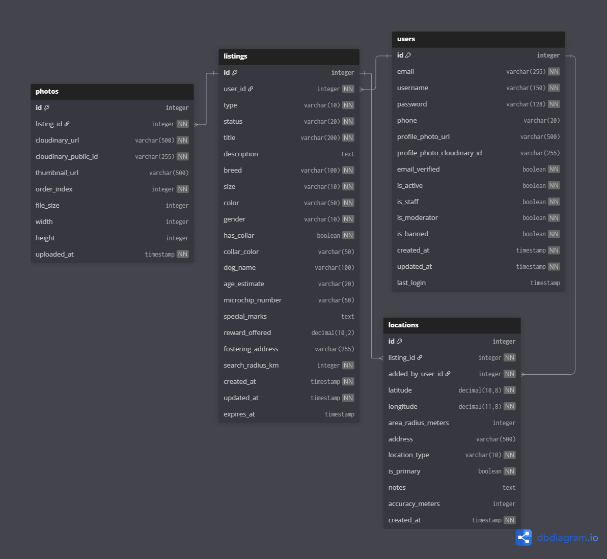

# Database Schema

## Overview

This document describes the database schema for the **Where Is My Dog?** MVP (Phase 1). The schema is designed for Django ORM with PostgreSQL + PostGIS.

**Phase 1 Goals:**
- Support core listing functionality (lost/found dogs)
- Enable geolocation-based search
- Support multiple location updates per listing
- Maintain user profiles and authentication

---

## ERD Diagram

> **Note:** Diagram created with [dbdiagram.io](https://dbdiagram.io)

---

## Tables

**MVP consists of 4 tables:**

1. **Users** - User accounts, authentication, profile photos
2. **Listings** - Dog listings (lost/found) with characteristics
3. **Photos** - Max 2 photos per listing (Cloudinary URLs)
4. **Locations** - Geographic data with support for precise points or areas (privacy)

**Key Features:**
- Search for lost/found dogs by location (radius-based)
- Add listings with photos and detailed characteristics
- Privacy support: show approximate area instead of exact location
- Location updates: track dog's movement across multiple sightings
- User profiles with photos for trust and identification

---

## Phase 2 & 3

Planned tables for future phases:

**Phase 2:** ChatMessages, Notifications, Points, Confirmations, SavedSearches

**Phase 3:** Reports, ModeratorActions, UserWarnings, StatusHistory, Reunions

---